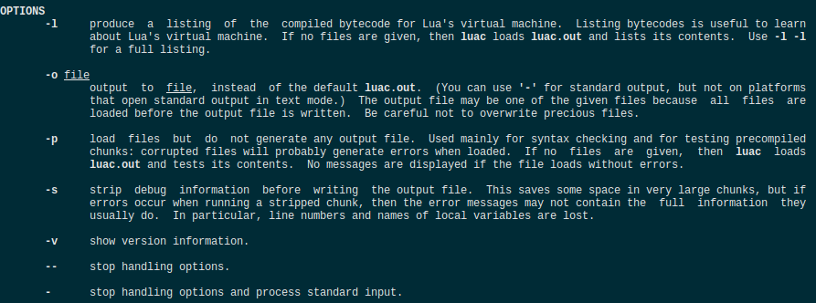
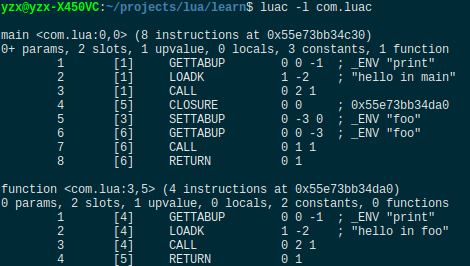
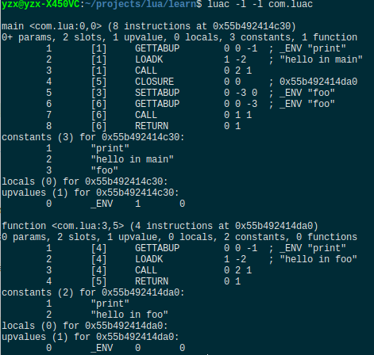

Lua 编译器以函数为单位进行编译，每个函数都会被编译成一个叫做“原型”（Prototype）的内部结构，其中包含函数基本信息、字节码、常量表、Upvalue 表、调试信息、子函数原型列共六部分。因为包含子函数，所以这种结构其实递归的。

### 怎么查看二进制 chunk？

通过 `man luac` 查看 luac 的相关参数如下所示：



- 不加任何参数将生成以`.out` 为后缀的二进制文件
- -l：显示字节码列表信息
- -o filename：生成文件名为 `filename` 的二进制文件
- -s：不包含调试信息
- -p：只进行语法检查
- -v：显示版本信息

编写测试脚本

```lua
print("hello in main")

function foo()
	print("hello in foo")
end
foo()
```

输入下面命令进行编译生成`com.luac`二进制文件，

```lua
luac -o com.luac com.lua
luac -l com.luac
```

再对其进行分析




因为`com.lua`中包含两个函数，所以输出信息中包含了两个函数原型。

先看第一行，对于第一个函数原型，它以`main`开头，但源脚本文件中并没有主函数定义，其实是编译器自动添加上去的。而第二个函数以`function`开头，则说明是程序员自定义的函数。

接着是定义函数的源文件名和函数在源文件中的起止行号（对于主函数，起止行号都是 0），然后是指令数量和函数地址。

第二行给出的函数的固定参数数量（如果有+号，表示是一个 vararg 函数）、运行函数所需要的寄存器数量、upvalue 数量、局部变量数量、常量数量、子函数数量。

接下来的多行是指令列表，其中每一条包括指令序号、对应行号、操作玛、操作数，分号后面则是 luac 根据指令操作数生成的注释信息，以便我们理解。

使用 `-l -l` 可以查看更详细的原型信息




### 二进制 chunk 格式

- 二进制 chunk 类似 Java 中的字节码文件，但是二进制 chunk 的格式与属于 Lua 虚拟机内部实现细节，并没有像 Java 那样发布标准化的规范。
- 二进制 chunk 没有考虑跨平台，对于需要使用超过一个字节存储的数据，必须要字节顺序（Byte Order）问题。Lua 官方编译器在编译脚本时会直接按照本机的字节顺序生成 binary chunk 文件，当加载 binary chunk 文件时，会探测加载文件的字节顺序，如果和本机不匹配，则拒绝加载。
- binary chunk 格式设计没有考虑不同 Lua 版本的兼容问题，其做法是加载 binary chunk 时，先检测其版本号，如果不匹配，则拒绝加载。


